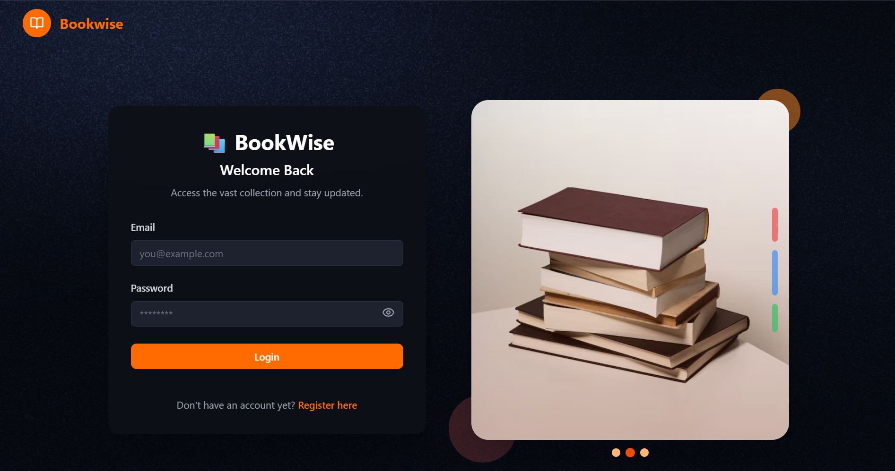
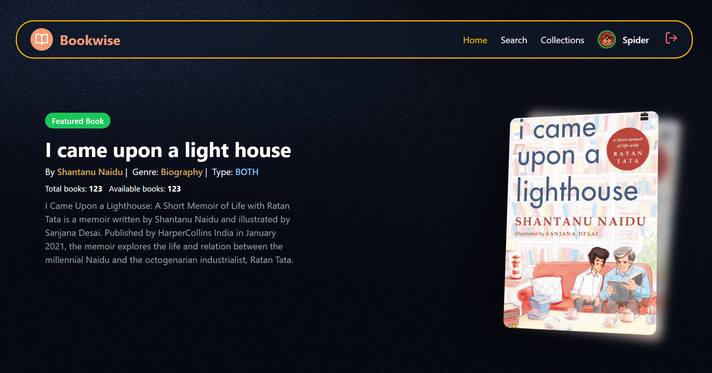
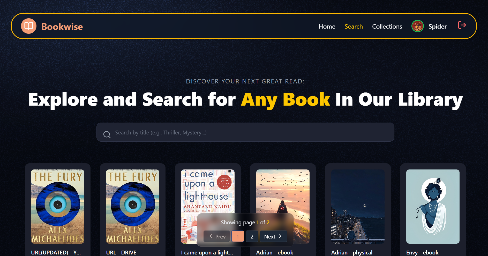
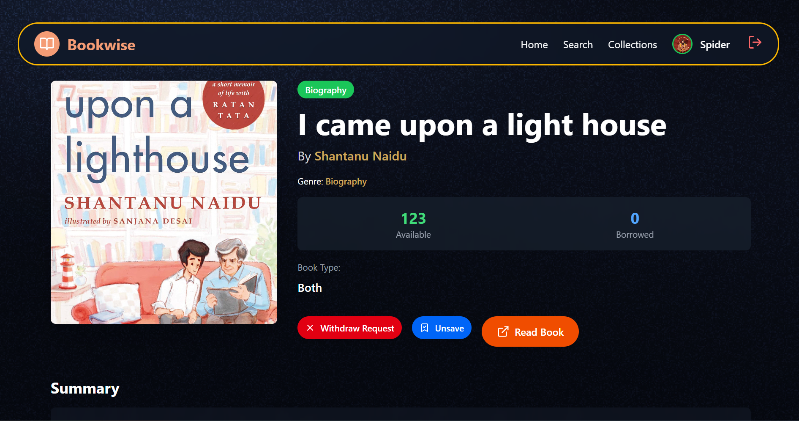
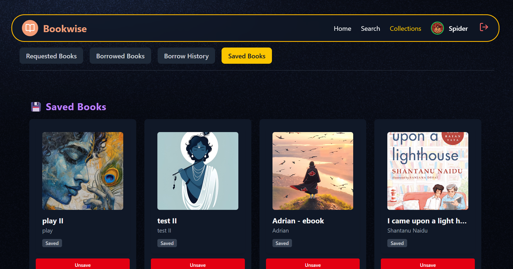
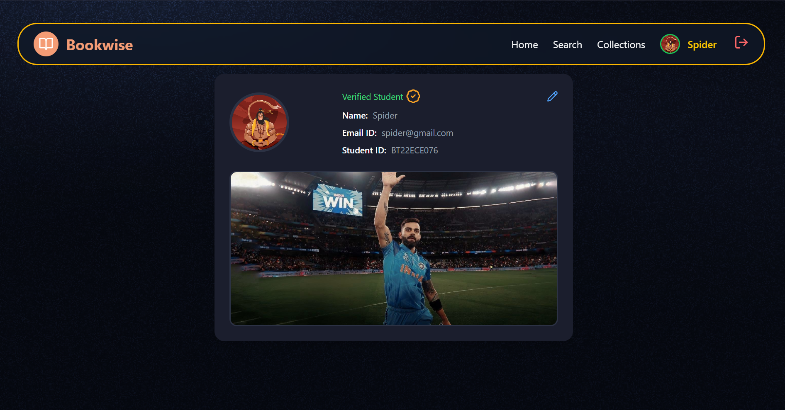

# 📚 BookWise

**BookWise** is a modern full-stack library management system designed for academic environments. It allows admins to manage books, handle student borrow requests, verify accounts, and more.

Built using **React (Vite)**, **Tailwind CSS**, **Node.js**, **Express.js**, and **MongoDB**.

---

## 🚀 Live Demo

* **Frontend (Admin Panel)**: [bookwise-admin.vercel.app](https://bookwise-admin.vercel.app)
* **Frontend (Main Site)**: [bookwise-main.vercel.app](https://bookwise-main.vercel.app)
* **Backend (API)**: Hosted on [Railway](https://railway.app/)

---

## 🗃️ Github repo

* **Admin Panel**: [github.com/bhavyank89/bookWise-Admin](https://github.com/bhavyank89/bookWise-Admin)
* **Main Panel**: [github.com/bhavyank89/bookWise](https://github.com/bhavyank89/bookWise)

---

## ✨ Features

* 🔐 Admin Login & Signup
* 👩‍🎓 Student Registration & Verification
* 📚 Add, Edit, Delete, View Books (PDF/Video support)
* 📅 Borrow Requests & History
* 🔎 Live Search, Pagination & Sorting
* 📦 Download Books list as CSV or PDF
* 🎨 Smooth Animations with Framer Motion
* 🔔 Toast Notifications & Tooltips
* 🔒 Role-based Routing

---

## 🏗️ Tech Stack

### Frontend

* **React 19 + Vite**
* **TailwindCSS**
* **Framer Motion**
* **React Router v7**
* **Lottie React / dotLottie**
* **React Hot Toast & Sonner**
* **Lucide & Radix UI**

### Backend

* **Express.js**
* **MongoDB**
* **Mongoose**
* **Cloudinary**
* **JWT Authentication**
* **Multer**

---

## 📂 Project Structure

```
📆 bookWise
├── frontend-dev/             # React + Vite frontend
│   ├── public/
│   ├── src/
│   │   ├── components/       # Reusable React components
│   │   ├── App.jsx
│   │   ├── App.css
│   │   ├── index.css
│   │   └── main.jsx
│   ├── index.html
│   └── vite.config.js
│
├── backend/                  # Express backend
│   ├── db/db.js              # MongoDB connection
│   ├── middleware/           # Middlewares
│   │   ├── FetchUser.js
│   │   ├── updateUser.js
│   │   ├── uploadFile.js
│   │   └── uploadUser.js
│   ├── models/               # Mongoose models
│   │   ├── Book.js
│   │   └── User.js
│   ├── routes/               # API routes
│   │   ├── Home.js
│   │   ├── Auth.js
│   │   ├── User.js
│   │   └── Book.js
│   ├── .env
│   ├── .gitignore
│   ├── package.json
│   ├── package-lock.json
│   └── index.js
│
├── README.md
```

---

## ⚙️ Environment Variables

### Frontend `.env` (placed in `frontend-dev/`)

```env
VITE_SERVER_URL=http://localhost:4000
VITE_ADMIN_URL=http://localhost:3001
VITE_MAIN_URL=http://localhost:3000
```

### Backend `.env` (placed in `backend/`)

```env
MONGO_URI=your_mongodb_uri
JWT_SECRET=your_secret
CLOUDINARY_CLOUD_NAME=your_cloud_name
CLOUDINARY_API_KEY=your_api_key
CLOUDINARY_API_SECRET=your_api_secret
MAIN_URL=http://localhost:3000
ADMIN_URL=http://localhost:3001
```

---

## 🛠️ Local Development

### Step 1: Clone the Repository

```bash
git clone https://github.com/bhavyank89/bookWise.git
cd bookWise
```

### Step 2: Setup Backend

```bash
cd backend
npm install
npm run dev
```

### Step 3: Setup Frontend

```bash
cd ../frontend-dev
npm install
npm run dev
```

---

## 📦 Deployment

### Backend on Railway

* Import the `backend/` directory into Railway
* Add environment variables from `.env`
* Deploy from GitHub

### Frontend on Vercel

* Import `frontend-dev/` as a separate Vercel project
* Set environment variables
* Deploy

---

## 📸 Screenshots

#### Landing Page


#### Role Selection


#### Login/Signup Page



#### Dashboard



#### Search



#### Book Details



#### Collections



#### Profile



---

## 🙌 Contributing

PRs are welcome! If you have suggestions or improvements, feel free to [open an issue](https://github.com/bhavyank89/bookWise/issues) or fork and contribute.

---

## 🧠 Author

Made with ❤️ by [Bhavyank Sarolia](https://github.com/bhavyank89)

---

## 📃 License

This project is licensed under the [MIT License](LICENSE).
